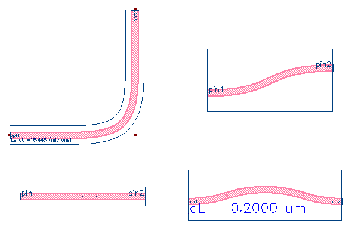
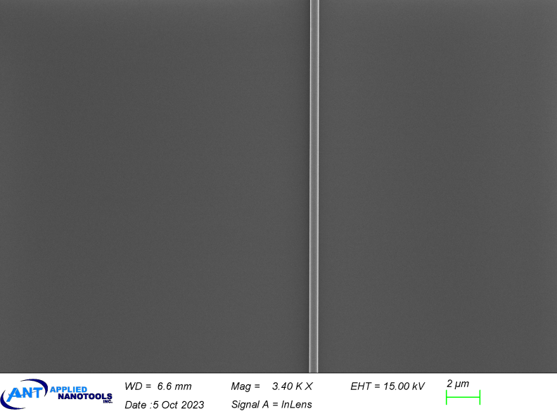
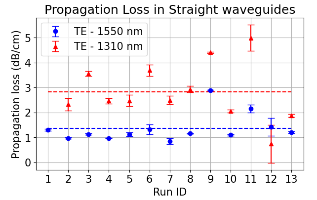
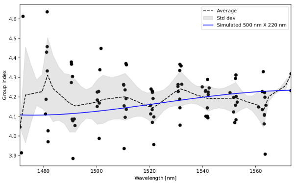

# Waveguides

## Description

Waveguides are components that guide waves. Although these are individual components that can be adjusted
for use, it is recommended to draw paths in KLayout and convert them to waveguides using the built-in SiEPIC
features.
Waveguide_bump is specifically used to make a slightly longer waveguide within the same amount of space, e.g.,
20 μm, plus 50 nm.

## Model Name
- Waveguide
- Waveguide_bump
- Waveguide_bend
- Waveguide_sbend
- Waveguide_straight

*Fig. 1: Layout of waveguides*

## Compact Model Information

- Support for TE and TM polarization
- Operating around 1550 nm and 1310 nmwavelength

*Fig. 2: SEM Picture of Bragg Gratings*

## Experimental Results

*Fig. 3: Measured Loss*

*Fig. 4: Measured waveguide group index*

## Additional Details

- **Design tools & methodology:**
  - Support for Monte Carlo using wafer map
  - Model uses interpolation for geometries not in the database
  - In “Electron beam lithography writing strategies for low loss high confinement silicon optical waveguides,”
    - 400 nm waveguide width was used. A variety of write methods were explored which had trade-offs of
    - write-time vs. loss.
    - SiEPIC runs use 4th Lens, 2-pass field shift writing, with default 6 nm shot pitch, 8 nA beam current.
    - Design tools & methodology: Cut-back method for determining loss from “Electron beam lithography
    writing strategies for low loss high confinement silicon optical waveguides”

- **Reference:**
  - R. J. Bojko, J. Li, L. He, T. Baehr-Jones, M. Hochberg, Y. Aida, "Electron beam lithography writing strategies
for low loss high confinement silicon optical waveguides", J. Vac. Sci. Technol. B, vol. 29, no. 6, Oct. 2011.