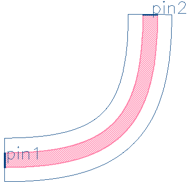
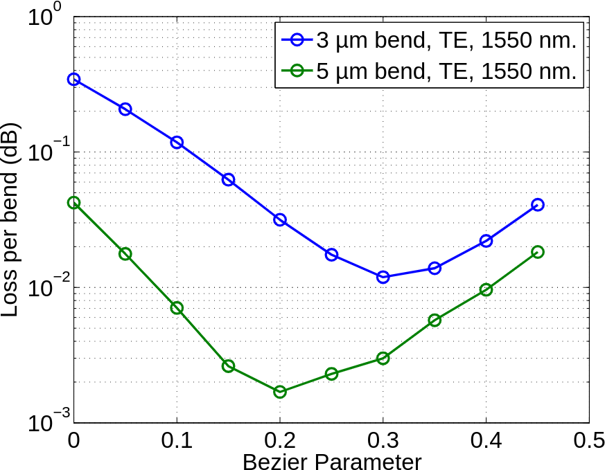

# bezier_bend

## Component Name

- Bezier_Bend (EBeam_Beta)

## Description
Waveguide bend PCell using Bezier curve.

## Model Name

**[Model Name]**

*Fig. 1: Layout of Bezier_Bend*

## Compact Model Information

- No compact model available.

## Parameters

| Parameter      | Default Value | Notes       |
|----------------|---------------|-------------|
| Bezier factor  | 25            | [Note_1]    |
| Effective bend radius  | 5.0um     | [Note_2]    |
| Waveguide width  | 500nm     | [Note_3]    |
| Layers  | 1     | [Note_4]    |

## Experimental Results

*Fig. 2: Experimental Results*

## Additional Details

- **Design tools & methodology:**
  - 3D-FDTD (Lumerical FDTD Solutions)
  - Eigenmode expansion propagator (MODE Solutions)

- **Reference:**
  - Han Yun, et al., "2×2 Adiabatic 3-dB Coupler on Silicon-on-Insulator Rib Waveguides",
Proc. SPIE, Photonics North 2013, vol. 8915, pp. 89150V, 06/2013 [(pdf)](refs/2x2%20Adiabatic%203dB%20Coupler%20in%20Silicon-on-Insulator%20Rib%20Waveguide.pdf)

