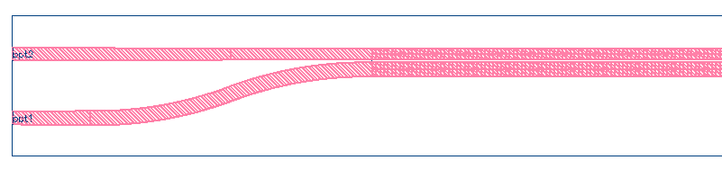
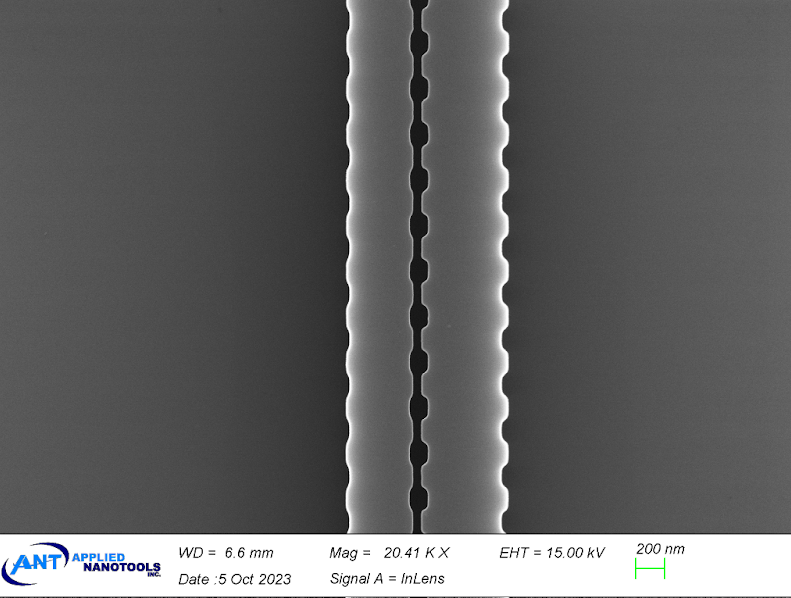
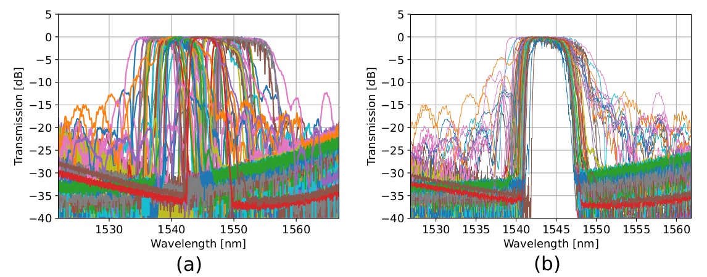
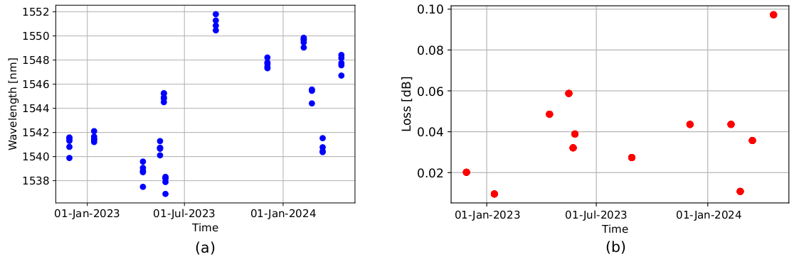
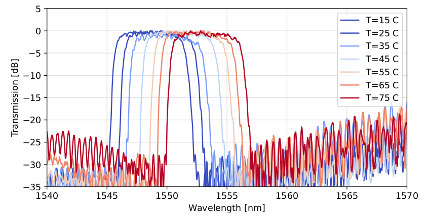

# Contra-directional couplers

## Component Name

- contra_directional_coupler

Other custom designs (EBeam_Beta):
- Contra_DC_Bent
- Contra_DC_CoupelrApodized
- Contra_DC_SWG
- Contra_DC_SWG_Chirped
- Contra_DC_Custom
- Contra_DC_DualBragg

## Description

Waveguide contra-directional couplers (CDCs) with high coupling efficiency and low back reflections for both transverse electric (TE) and transverse magnetic (TM) modes. This device can be used as an optical add-drop filter.

## Model Name

*Fig. 1: Layout of contra_directional_coupler*

## Compact Model Information

- Support for TE polarization
- Operating at 1550 nm wavelength
- Performance:
  - TE – 6 nm 3-dB bandwidth, 0.05 dB insertion loss

*Fig. 2: SEM Picture of contra-directional couplers*

## Parameters

| Parameter      | Default Value | Notes       |
|----------------|---------------|-------------|
| Number of Grating Periods  | 300     | [Note_1]    |
| Grating Period (microns)  | 0.317     | in microns     |
| Waveguide 1 Corrugation Width (microns)  | 0.05     | in microns     |
| Waveguide 2 Corrugation Width (microns)  | 0.03     | in microns     |
| Grating Type  | False     | False = Rectangular, True = Sinusoidal     |
| Waveguide1  Width (microns)  | 0.56     | in microns     |
| Waveguide2 Width (microns)  | 0.44     | in microns     |
| S-bend Length (microns)  | 10     | in microns     |
| S-bend radius (microns)  | 15     | in microns     |
| Gaussian apodization index  | 10     |     |
| Gap (microns)  | 0.1     | in microns     |
| Anti-reflection  | False     | True/False     |

## Experimental Results

*Fig. 3: (a) Measured and calibrated drop port spectra of various contra-
DCs of various stages, fabricated from October 2021 to February 2024.
(b) The same measurements off-setted to a common center wavelength
to highlight the effects of variability on the devices’ spectra.*

*Fig. 4: Statistically extracted measurements of the same contra-DC de-
vice measured across various fabrication runs on the same fabrication
process highlighting: (a) the effects of process variability on process
corners and (b) the effects of process variability on the device’s inser-
tion loss.

*Fig. 5: Measurements of a contra-DC device vs. temperature. The plot
shows the calibrated transmission spectra of the device at various tem-
peratures ranging from 15°C to 75°C. As temperature increases, the
transmission peak shifts, demonstrating the temperature-dependent be-
havior of the device. The gradient color scheme represents different
temperatures, with blue indicating lower temperatures and red indicat-
ing higher temperatures.*

## Additional Details

- **Design tools & methodology:**
  - Hand-drawn layout (kLayout)
  - Post-fabrication modeling using band-structure calculation in 3D-FDTD
  - (Lumerical FDTD Solutions)
  - [Simulation and layout tutorials](https://github.com/SiEPIC/SiEPIC_Bragg_workshop/tree/main/contra_directional_couplers)
