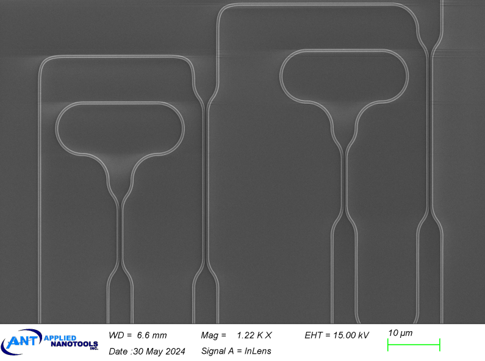
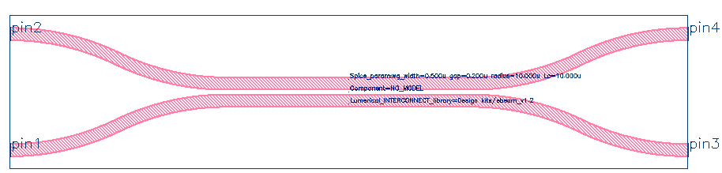
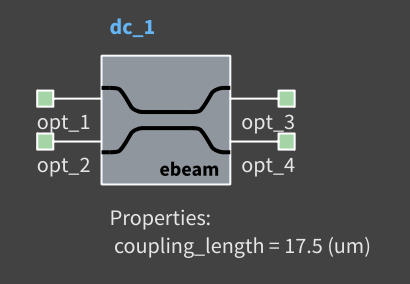
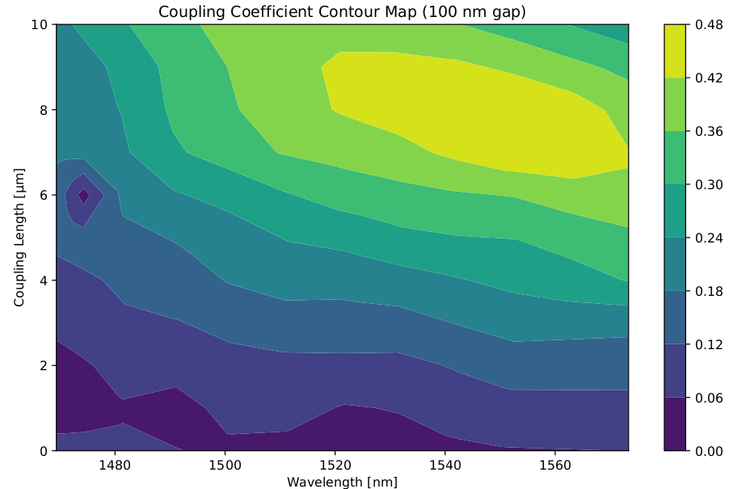

# ebeam_dc

## Component Name

- ebeam_dc_te1550
- ebeam_dc (EBeam_Beta)

## Description
The directional coupler is commonly used for splitting and combining light in photonics. It consists of two parallel
waveguides where the coupling coefficient is influenced by the waveguide length and the distance between
waveguides.

## Model Name

*Fig. 1: Layout of Directional Coupler*

## Compact Model Information

## Parameters

| Parameter      | Default Value | Notes       |
|----------------|---------------|-------------|
| Coupling Length  | 10     | in microns     |
| Radius  | 10.0     | in microns     |
| Waveguide width  | 0.5     | in microns     |
| Gap  | 0.2     | in microns     |
| Layers  | 1     |     |

## Experimental Results

*Fig. 2: Experimental Results for TE 1550 nm*

## Additional Details

- **Design tools & methodology:**
  - 3D-FDTD (Lumerical FDTD Solutions)
  - Eigenmode expansion propagator (MODE Solutions)

- **Reference:**
  - 