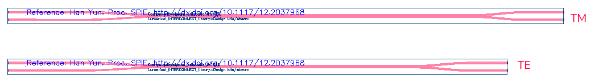
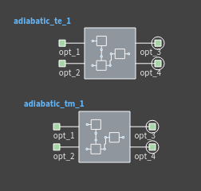
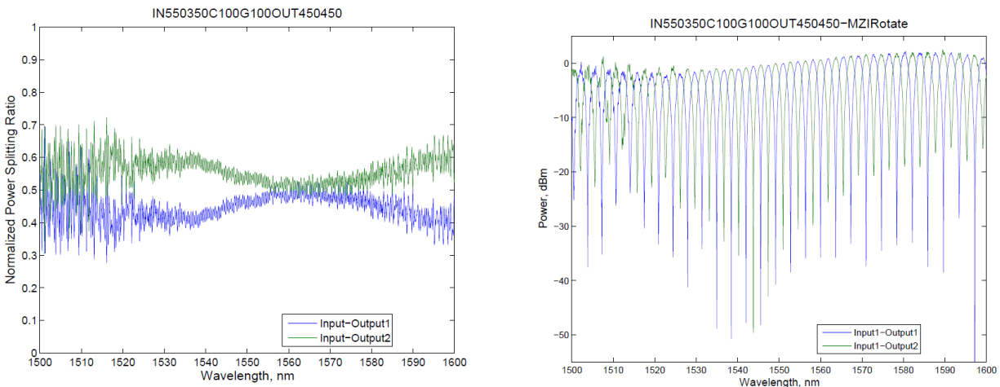
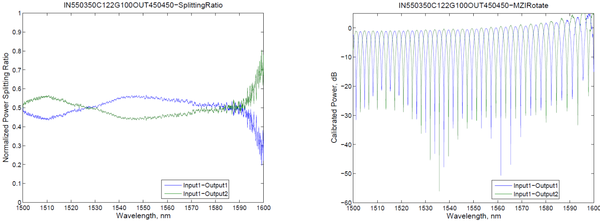

# ebeam_adiabatic

## Component Name

- ebeam_adiabatic_te1550
- ebeam_adiabatic_tm1550

## Description

50/50% 2×2 broadband adiabatic 3-dB couplers/splitters. Two 3-dB couplers can be used to make
an unbalanced Mach-Zehnder Interferometer (MZI), showing a large extinction ratio. The
advantage of this device compared to the Y-Branch is that it has 2x2 ports, thus the MZI has two
outputs. Compared to the directional coupler, it is less wavelength sensitive.

## Model Name

**[Model Name]**

*Fig. 1: Layout of ebeam_adiabatic_te1550 and ebeam_adiabatic_tm1550*

*Fig. 2: Compact Model of ebeam_adiabatic_te1550 and ebeam_adiabatic_tm1550*

## Compact Model Information

- Support for TE and TM polarization using their respective models
- Operating at 1550 nm wavelength
- **Performance:** 
  - Insertion Loss, 3dB Bandwidth
  - TE – TBD
  - TM - TBD
- For use with strip waveguides only
- Splitting ratio was extracted from the unbalanced MZI spectra.
- Excess loss negligible

## Parameters

- Fixed component. No parameters to set.

## Experimental Results
- [TE](Adiabatic3dB_TE_FullEtch/EB471A_Adiabatic3dB_SingleEtch_TE_Results.pdf)

*Fig. 3: Experimental Results for TE*
- [TM](Adiabatic3dB_TM_FullEtch/EB471A_Adiabatic3dB_SingleEtch_TM_Results.pdf)

*Fig. 4: Experimental Results for TM*

## Additional Details

- **Design tools & methodology:**
  - 3D-FDTD (Lumerical FDTD Solutions)
  - Eigenmode expansion propagator (MODE Solutions)
- Test structures:
  - [Unbalanced MZI (TE)](Adiabatic3dB_TE_FullEtch)
  - [Unbalanced MZI (TM)](Adiabatic3dB_TM_FullEtch)

- **Reference:**
  - Han Yun, et al., "2×2 Adiabatic 3-dB Coupler on Silicon-on-Insulator Rib Waveguides",
Proc. SPIE, Photonics North 2013, vol. 8915, pp. 89150V, 06/2013 [(pdf)](refs/2x2%20Adiabatic%203dB%20Coupler%20in%20Silicon-on-Insulator%20Rib%20Waveguide.pdf)

