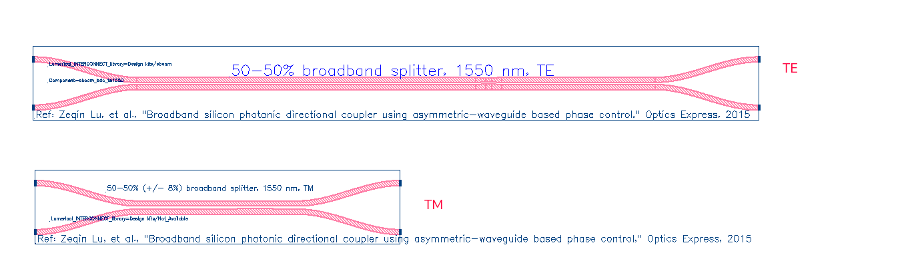
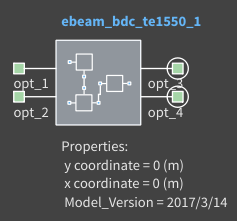
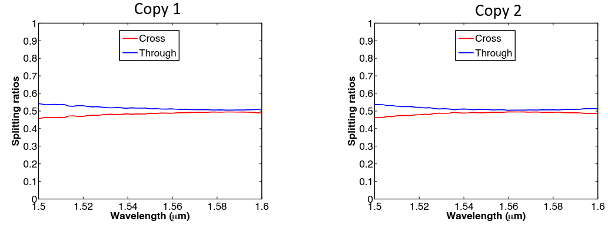
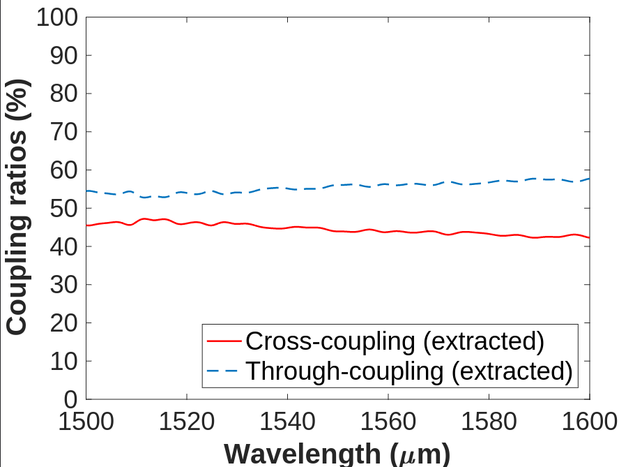

# ebeam_bdc

ebeam_bdc_te1550
ebeam_bdc_tm1550 (EBeam_Beta)

## Description

50/50% broadband directional 3-dB couplers. Two 3-dB couplers can be used to make an unbalanced Mach-
Zehnder Interferometer (MZI), showing a large extinction ratio. The advantage of this device compared to the Y-
Branch is that it has 2x2 ports, thus the MZI has two outputs. Compared to the directional coupler, it is less
wavelength sensitive.

## Model Name

*Fig. 1: Layout of ebeam_bdc_te1550 and ebeam_bdc_tm1550*

## Compact Model Information

- Support for TE and TM polarizations
- Operating at 1550 nm wavelength
- Performance (Insertion Loss, 3dB Bandwidth):
  - TE – TBD
  - TM – TBD
  - Splitting ratio was extracted from the unbalanced MZI spectra.
  - Excess loss negligible

## Parameters

- Fixed component. No parameters to set.

## Experimental Results

*Fig. 2: Experimental Results for TE 1550 nm*

*Fig. 3: Experimental Results for TM 1550 nm*

## Additional Details

- **Design tools & methodology:**
  - MATLAB
  - 3D-FDTD (Lumerical FDTD Solutions)
  - Eigenmode expansion propagator (MODE Solutions)

- **Reference:**
  - Zeqin Lu, Han Yun, Yun Wang, Zhitian Chen, Fan Zhang, Nicolas A. F. Jaeger, Lukas Chrostowski,
"Broadband silicon photonic directional coupler using asymmetric-waveguide based phase control", Opt.
Express, vol. 23, issue 3: OSA, pp. 3795--3808, 02/2015,
http://www.opticsexpress.org/abstract.cfm?URI=oe-23-3-3795

