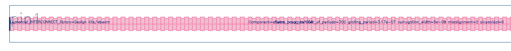
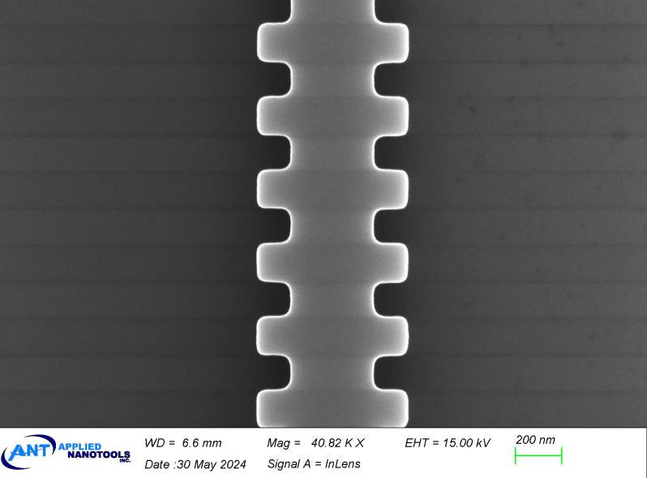
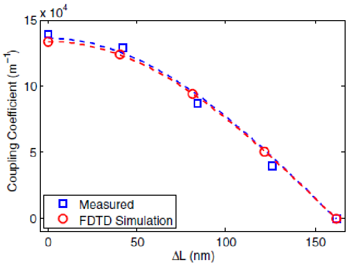
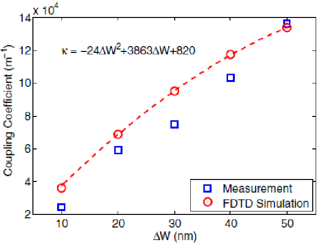
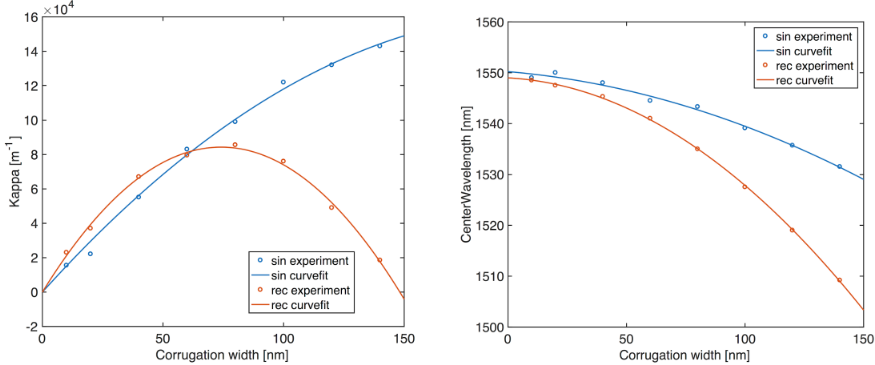
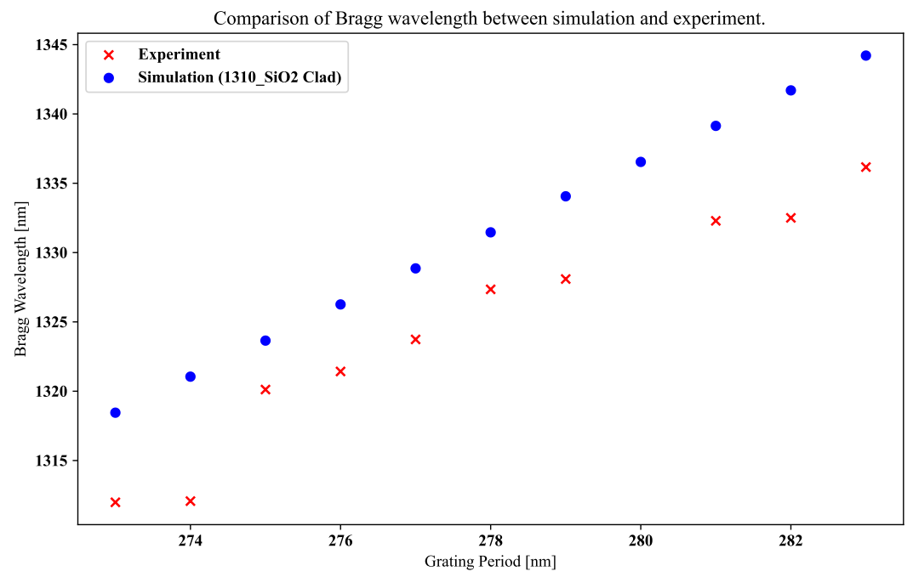
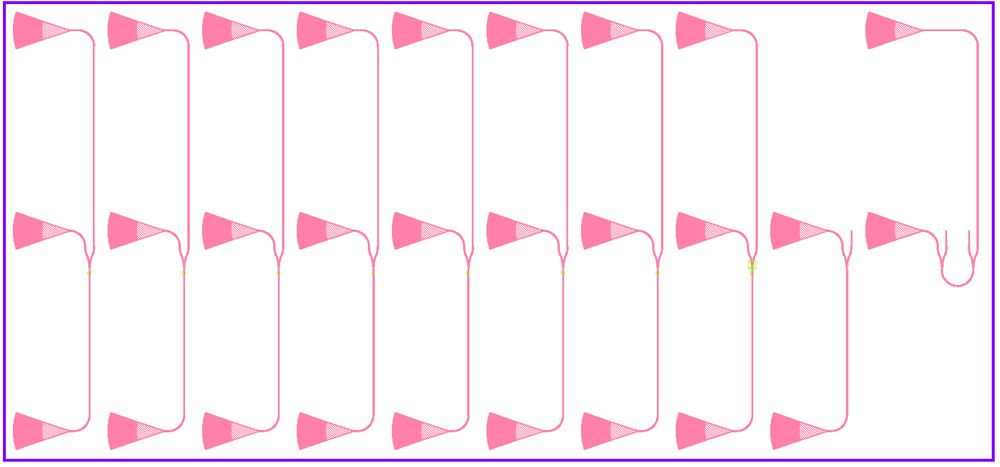

# ebeam_bragg

## Description

Uniform waveguide Bragg gratings, 1st order, TE polarization. This design provides a simple
method of varying the grating strength (kappa) by changing the corrugation width (0 to 150 nm)
and/or grating misalignment. The gratings can be either rectangular or sinusoidal (sinusoidal have
more predictable performance).

## Model Name

*Fig. 1: Layout of ebeam_bragg_te1550*

## Compact Model Information

- Support for TE polarization
- Operating at 1550 nm wavelength
- Performance:
  - TE – TBD
- Grating misalignment:
  - Kappa ranging from ~0 to 140,000 m-1, for a fixed ∆W = 50 nm, with misalignment
  - Measured with oxide cladding.
- Number of fabrication iterations (separate runs) to get to published results: 1
- Number of variations fabricated: 10

*Fig. 2: SEM Picture of Bragg Gratings*

## Parameters

| Parameter      | Default Value | Notes       |
|----------------|---------------|-------------|
| Number of Grating Periods  | 300     | [Note_1]    |
| Grating Period (microns)  | 0.317     | in microns     |
| Corrugation Width (microns)  | 0.05     | in microns     |
| Grating Misalignment (microns)  | 0     | in microns     |
| Grating Type  | False     | False = Rectangular, True = Sinusoidal     |
| Waveguide Width (microns)  | 0.5     | in microns     |

## Experimental Results

From **[Source]**:
From Xu Wang, et al., "Precise control of the coupling coefficient through destructive interference
in silicon waveguide Bragg gratings":

*Fig. 3:  Simulation and Experimental Results for Coupling Coefficients as a Function of
misalignment Length for Gratings with Fixed Corrugation Width (∆W = 50 nm)

*Fig. 4: Simulation and Experimental Results for Coupling Coefficients as a Function of Corrugation
Width for Gratings with No Misalignment (∆L = 0)

From Ajay Mistry:

*Fig. 5: Measured Kappa vs. Corrugation Width for Gratings with No Misalignment (∆L = 0)*

*Fig. 6: Measured Bragg grating shift for TE 1310 nm*

## Additional Details

- **Design tools & methodology:**
  - Hand-drawn layout (kLayout)
  - Post-fabrication modeling using band-structure calculation in 3D-FDTD
  - (Lumerical FDTD Solutions)
  - [Simulation and layout tutorials](https://github.com/SiEPIC/SiEPIC_Bragg_workshop/tree/main/bragg_gratings)
- **Measurement Data:**
  - From 11/2017 Fabrication Run by Applied Nanotools:
  - https://github.com/lukasc-ubc/edX-Phot1x/tree/master/2017_Bragg_grating
- **Reference:**
  - Xu Wang, et al., "Precise control of the coupling coefficient through destructive interference in silicon waveguide Bragg gratings", Optics Letters, vol. 39, issue 19, pp. 5519-5522, 10/2014 [(pdf)](refs/ol-39-19-5519.pdf)

  - [Test structures](refs/lukasc_BraffShift.gds)

*Fig. 6: Test structures*
