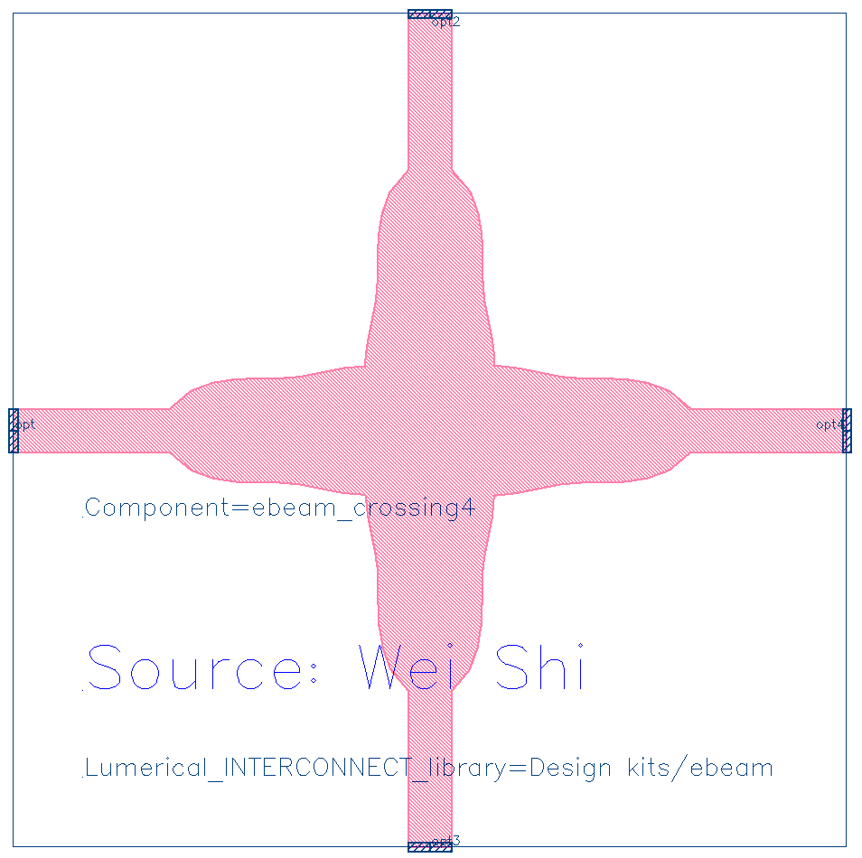
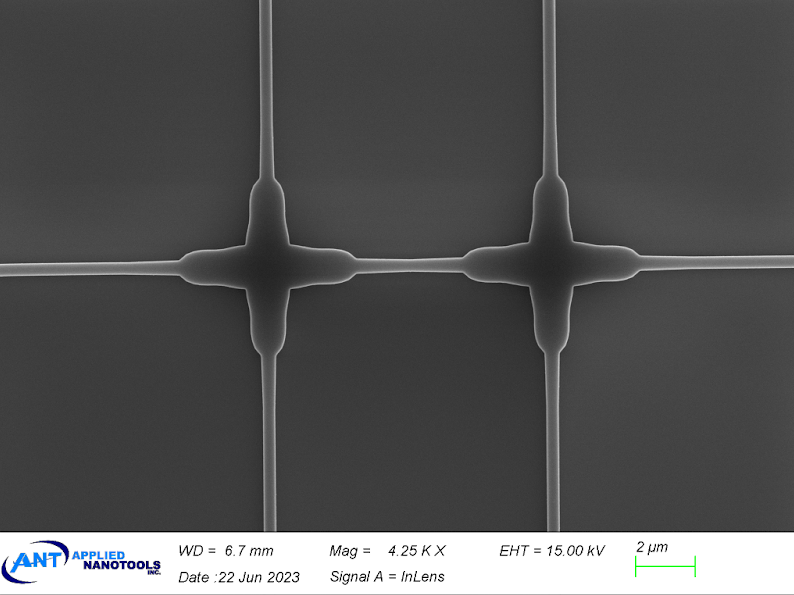
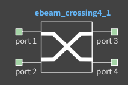
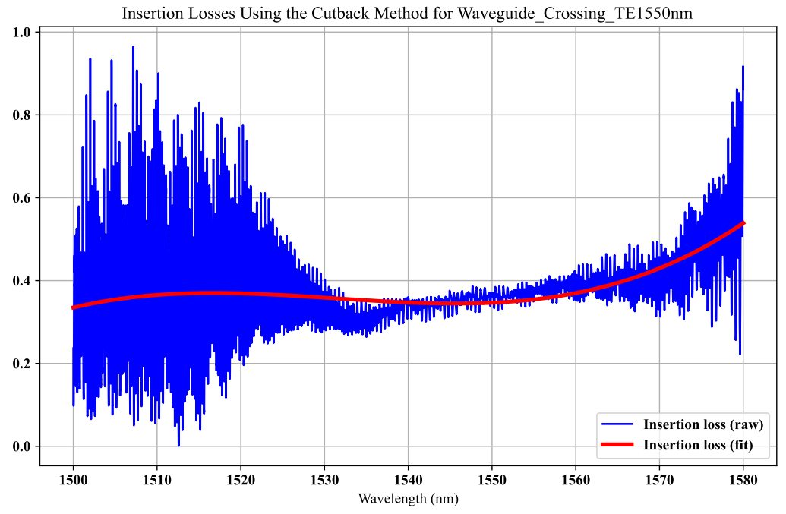

# ebeam_crossing

## Component Name

- ebeam_crossing4

## Description

Crossings are used to support the routing of more complex photonic circuits. Improvement to the waveguide’s
transmission can be achieved by reducing diffraction that occurs in the component’s centre crossing region. To
widen the waveguide’s core, elliptical mode expanders are used for this component.

*Fig. 1: Layout of ebeam_crossing4*

*Fig. 2: SEM Picture of ebeam_crossing4*

## Compact Model Information

*Fig. 3: Compact Model of ebeam_crossing4*

- Support for TE and TM polarization
- Operating at 1550 nm wavelength
- Performance:
  - Transmission loss: < 0.2 dB
  - Crosstalk and reflection: < 40 dB in a broad bandwidth of 20 nm
- Implemented by Wei Shi in 2011 based on “Highly efficient crossing structure for silicon-on-insulator
waveguides”
- Similarly fabricated by OpSIS and published with test results in “A CMOS-Compatible, Low-Loss, and
Low-Crosstalk Silicon Waveguide Crossing”

## Parameters

- Fixed component. No parameters to set.

## Experimental Results

*Fig. 4: Experimental Results for TE 1550 nm*

*Fig. 5: Experimental Results for TE 1310 nm*

- Refer to wafer measurement report for more details:  [Report](refs/Crossing4_report_waferS3_chip20.pdf)

## Additional Details
Potential Usage
- 2x2 splitter/combiner, with adjustable coupling coefficient
- Ring resonator
- Mach-Zehnder Interferometer

- **Design tools & methodology:**
  - 3D-FDTD (Lumerical FDTD Solutions)
  - Inverse design and particle swarm optimization

- **Reference:**
1. P. Sanchis, et al., Highly efficient crossing structure for silicon-on-insulator waveguides, Opt. Lett., vol. 34,
no. 18, pp. 2760-2762, 2009. [pdf](refs/Highly_efficient_crossing_structure_for_SOI_waveguides-P._Sanchis.pdf)
2. Yi Zhang, Shuyu Yang, Andy Eu-Jin Lim, Guo-Qiang Lo, Christophe Galland, Tom Baehr-Jones, and
Michael Hochberg, "A compact and low loss Y-junction for submicron silicon waveguide," Opt. Express 21,
1310-1316 (2013)