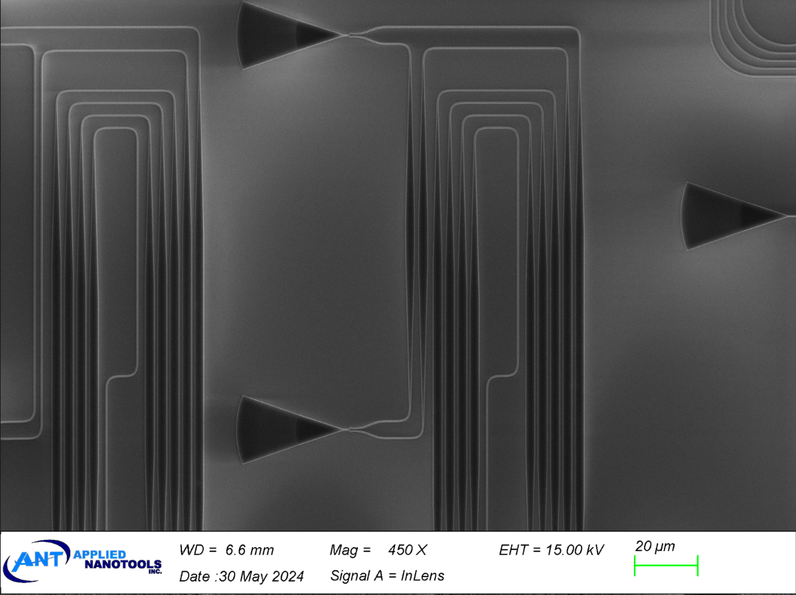
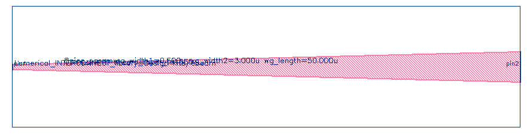

# ebeam_taper_te1550

## Description

Tapers are used to connect devices with different waveguide widths to prevent loss and ensure a smaller area for
waveguide transitions. The taper length is dependent on the indicated waveguide widths.

*Fig. 1: SEM image of tapers*

## Model Name

*Fig. 2: Layout of ebeam_taper_1550*

## Compact Model Information

Support for TE polarization
- Operating at 1550 nm wavelength
- Performance:
  - TE – TBD
  - TM - TBD

## Parameters

| Parameter      | Default Value | Notes       |
|----------------|---------------|-------------|
| Waveguide Width1  | 0.5     | CML only supports 0.4, 0.5, 0.6     |
| Waveguide Width2  | 3     | CML only supports 1, 2, 3     |
| Waveguide Width Length  | 10     | CML only supports a range of 1-10     |

