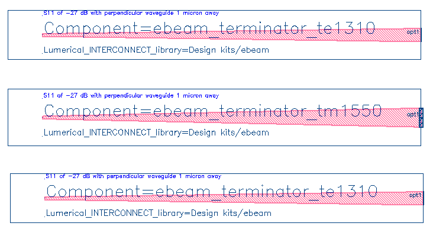
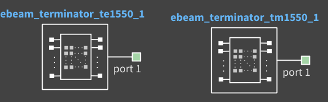

# ebeam_terminator

- ebeam_terminator_te1550
- ebeam_terminator_tm1550
- ebeam_terminator_te1310

## Description
This component is used to terminate a waveguide. This terminator is a nano-taper that spreads the light into the
oxide and is used for efficient edge coupling. Even if a waveguide crosses near this taper end, the reflection is
minimal. This is included in this model, 1 μm away, therefore, the model is a worst-case reflection. To terminate
unused ports on components to avoid reflections, refer to Disconnected Waveguides.

*Fig. 1: Layout of waveguide terminators*

## Compact Model Information

*Fig. 2: Compact Model*

## Parameters
- Fixed component. No parameters to set.

## Experimental Results
- None.

## Additional Details

- **Design tools & methodology:**
  - 3D-FDTD (Lumerical FDTD Solutions)
  - Eigenmode expansion propagator (MODE Solutions)

  - ebeam_terminator_te1550: Simulated using 3D-FDTD
  - ebeam_terminator_te1310: estimated reflection set at -30 dB

