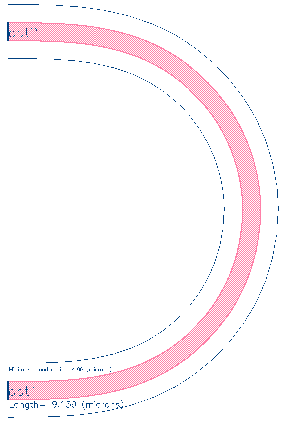
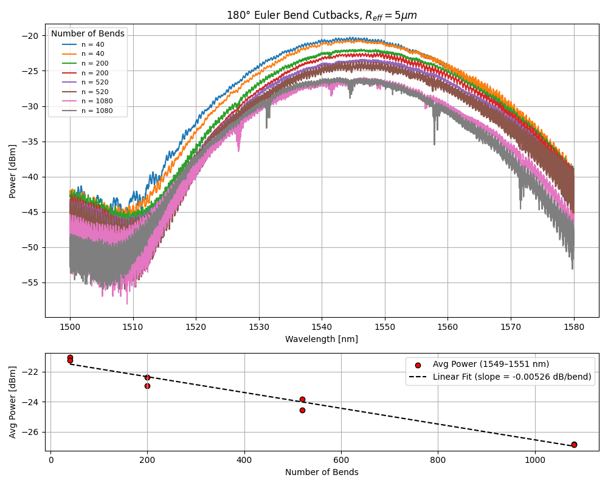
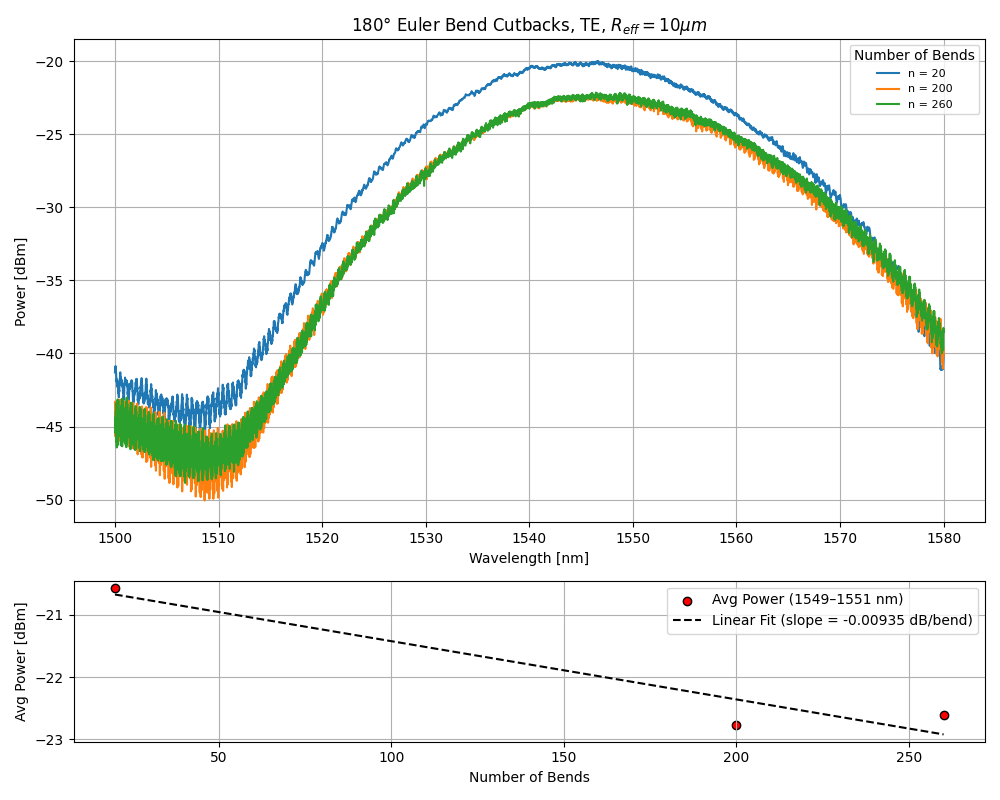

# euler_bend_180

## Component Name

- euler_bend_180 (EBeam_Beta)

## Description
180 degree waveguide Euler bend PCell (bend radius is a function of bend length). 

## Model

*Fig. 1: Layout of euler_bend_180*

## Compact Model Information

- No compact model available.

## Parameters

| Parameter      | Default Value |
|----------------|---------------|
| Effective Bend Radius  | 5 μm |
| Euler Parameter  | 0.25     |
| Waveguide width  | 500 nm     |

## Experimental Results for r_eff = 5μm, 10μm with p = 0.25 (default/not-optimized)

*Fig. 2: 5μm Experimental Results*

*Fig. 3: 10μm Experimental Results*

## Additional Details

Function to create points for a 180 degree Euler bend with 
radius and a user-specified bend parameter 'p'.
Inspired from GDS factory code [1] and Vogelbacher et al. (2019) paper:
'Analysis of silicon nitride partial Euler waveguide bends' [2].

## Refrences        
[1] https://github.com/gdsfactory/gdsfactory/blob/main/gdsfactory/path.py  
[2] https://dx.doi.org/10.1364/oe.27.031394
