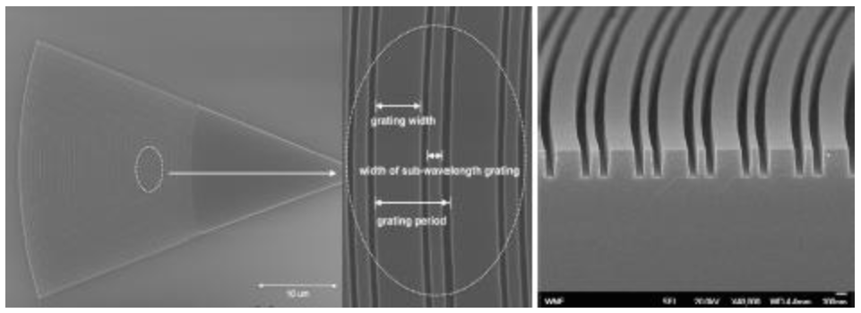
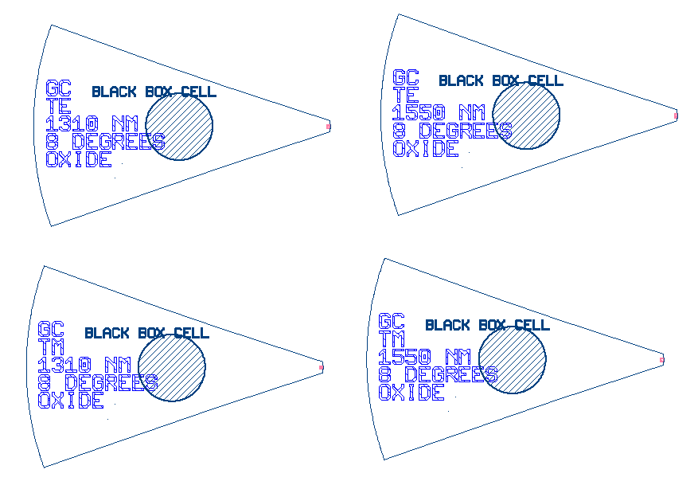
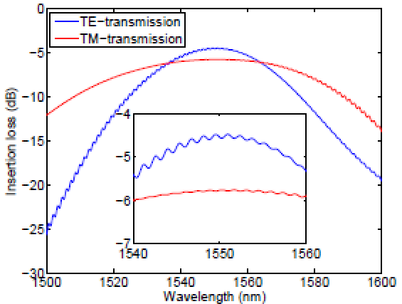
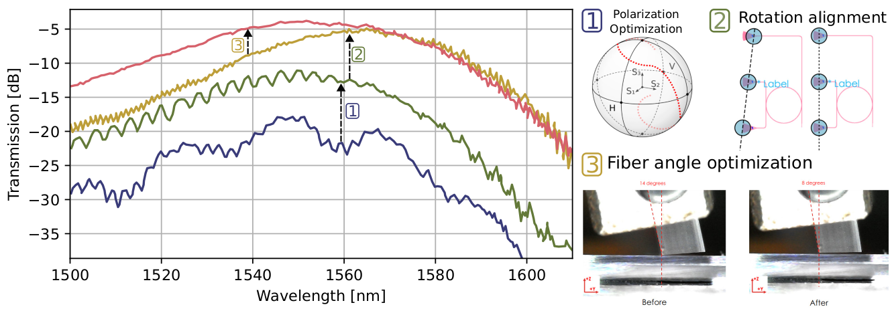

# Grating couplers

- GC_TE_1310_8degOxide_BB
- GC_TM_1310_8degOxide_BB
- GC_TE_1550_8degOxide_BB
- GC_TM_1550_8degOxide_BB

- 

## Description

Fully-etched fibre-waveguide grating couplers with sub-wavelength gratings showing high coupling efficiency as
well as low back reflections for both transverse electric (TE) and transverse magnetic (TM) modes. EBeam
fabrication cost is reduced by ~2-3X when eliminating the shallow etch.

*Fig. 1: SEM Picture of Grating Couplers*

## Model Name

*Fig. 2: Layout of grating couplers*

## Compact Model Information

- Support for TE and TM polarization using their respective models
- Operating at 1550 nm wavelength
- Performance:
  - TE – 4.1 dB loss, 30.6 nm 1-dB bandwidth
  - TM – 3.7 dB loss, 47.5 nm 1-dB bandwidth

## Parameters

- Fixed component. No parameters to set.

## Experimental Results

*Fig. 3: Experimental Results*

*Fig. 4: Experimental Calibration process*

## Additional Details

- **Design tools & methodology:**
  - Incremental Fabrication Cost: $0.02 each on Layer 1
  - Design Tools & Methodology: 2D & 3D FDTD (Lumerical Solutions), Scripted mask layout (Mentor
Graphics Pyxis)
- Support for Monte Carlo using wafer map
- Model uses S-Parameters generated for 9 variations
- Number of fabrication iterations (separate runs) to get to published results: 6
- Number of variations fabricated: 100+

- **Reference:**
1. Yun Wang, et al., "Focusing sub-wavelength grating couplers with low back reflections for rapid
prototyping of silicon photonic circuits", Optics Express, vol. 22, no. 17: OSA, pp. 20652-20662, 08/2014,
http://dx.doi.org/10.1364/OE.22.020652
2. Yun Wang, et al., “Apodized focusing fully etched sub-wavelength grating couplers”, Photonics Journal,
2015
3. Yun Wang, et al., “Design of Broadband Sub-Wavelength Grating Couplers with Low Back Reflection”,
Optics Letters, 2015
4. Yun Wang, et al., “Compact single-etched sub-wavelength grating couplers for O-band application”,
Optics Express, 2017