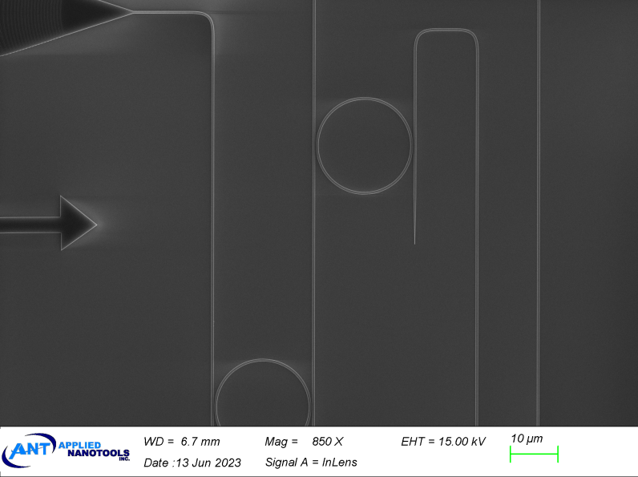
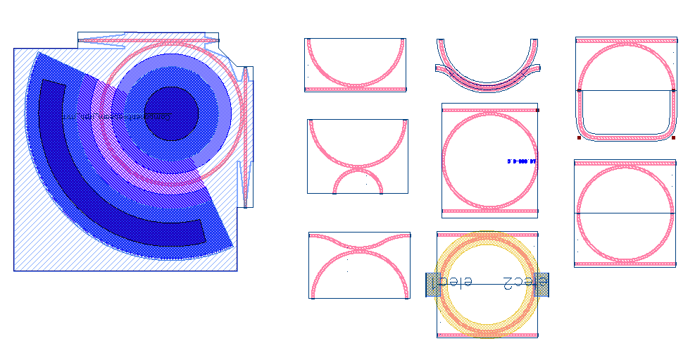
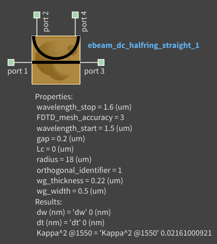
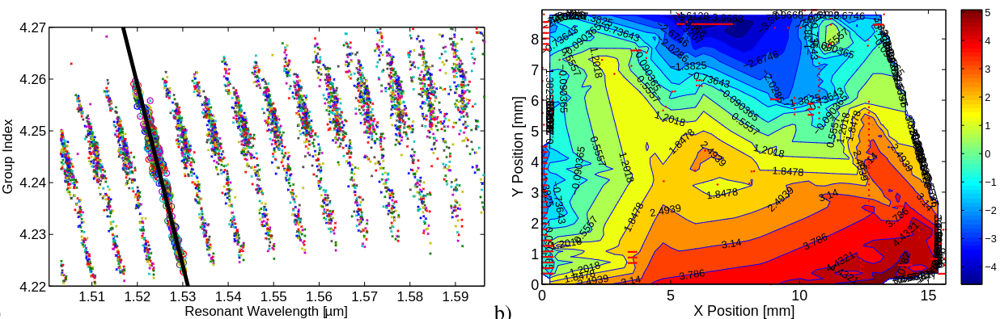

# Microring Resonators

- ebeam_dc_halfring_straight
- ebeam_dc_halfring (EBeam_Beta)
- ebeam_dc_halfring_arc (EBeam_Beta)
- ring_singlebus (EBeam_Beta)
- ring_doublebus (EBeam_Beta)
- doublebus_ring (EBeam_Beta)
- directionalcoupler_seriesrings
- directionalcoupler_bent
- ebeam_ring_heater (EBeam_Beta)
- ebeam_irph_mrr (EBeam_Beta)

## Description

Microring resonators. Useful for filters, sensors, etc. and to extract fabrication non-uniformity.

*Fig. 1: SEM image of a microring resonator*

## Model

*Fig. 2: Layout of ebeam_ring_1550*

## Compact Model Information

- Support for TE and TM polarization using the respective orthogonal identifier parameter
- Performance:
  - Found that for EBeam process with existing wafer stock, the wavelength variation for resonators
    - across the chip was +/- 3 nm.
    - Grating coupler insertion loss varied by +/- 1.5 dB.
    - Un-optimized ring: Line-width = 40 pm; Extinction Ratio = 6 dB

## Parameters

| Parameter      | Default Value | Notes       |
|----------------|---------------|-------------|
| Radius (microns)  | 10     |  microns    |
| Waveguide Width (microns)  | 0.5     |  microns     |
| Gap (microns)  | 0.2     |  microns     |
| Coupler Length (microns)  | 0     |  microns     |
| Orthogonal Identifier  | 1     |  1 = TE, 2 = TM     |

## Experimental Results
From L. Chrostowski, et al., "Impact of Fabrication Non-Uniformity on Chip-Scale Silicon Photonic Integrated
Circuits", Optical Fiber Conference, 2014:
- Negative linear relationship between group index and resonant wavelength
- Grating couplers are primarily sensitive to etch depth

*Fig. 3: Experimental Results for TE 1550 nm*

## Additional Details

- **Design tools & methodology:**
  - MATLAB
  - 3D-FDTD (Lumerical FDTD Solutions)
  - Eigenmode expansion propagator (MODE Solutions)

**Reference:**
1. L. Chrostowski, et al., "Impact of Fabrication Non-Uniformity on Chip-Scale Silicon Photonic Integrated Circuits",
Optical Fiber Conference, 2014 http://dx.doi.org/10.1364/OFC.2014.Th2A.37 [pdf](refs/2014_OFC_lukasc.pdf). [Layout](refs/Ring_OFC2014.gds)

2. Jared et al. "Improving the dimensional tolerance of microrings with adiabatically widened bends" [pdf](refs/CLEO_SI-2013-CM1F.5.pdf). [slides](refs/JoycePoon_group_Slides.pdf). [Layout](refs/JoycePoon_group.gds)