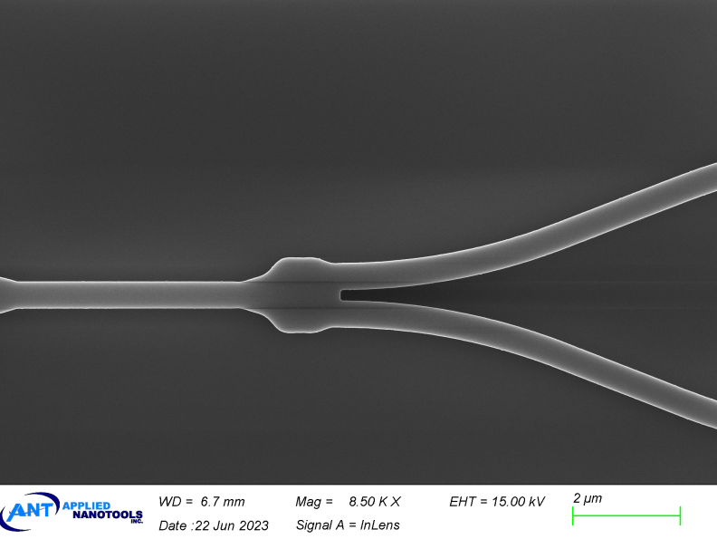
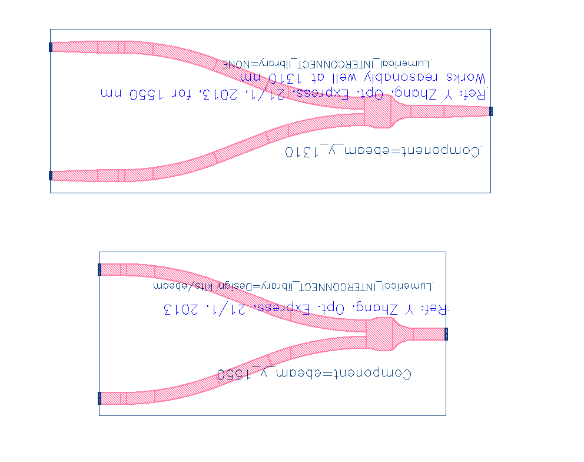
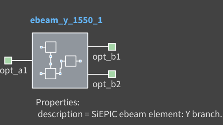
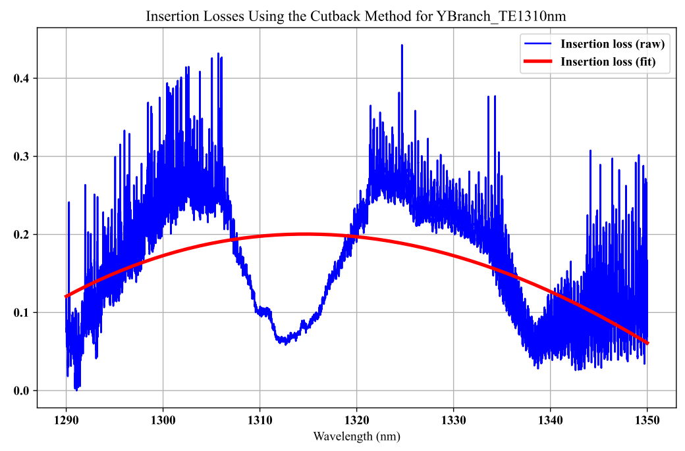

# y_branch

## Component Name

- ebeam_y_1550
- ebeam_y_1310

## Description

50/50% 3dB splitter. Useful for splitting light, Mach-Zehner Interferometers, etc. The layout parameters for the
device were taken from the journal paper below, and implemented in EBeam lithography.

*Fig. 1: SEM image of a Y-branch*

## Model Name

*Fig. 2: Layout of ebeam_y_1550 and ebeam_y_1310*

## Compact Model Information

- Support for TE polarization
- Operating at 1550 nm wavelength
  - Performance:
    - Excess Loss is < 1 dB
- Operating at 1310 nm wavelength: model excess loss set at 0.2 dB

## Parameters

- Fixed component. No parameters to set.

## Experimental Results

From Y Zhang, et al., “A compact and low loss Y-junction for submicron silicon waveguide”:
- Insertion loss of 0.28 +/- 0.02 dB, uniform across an 8-inch wafer
- Output power and splitting ratio are uniform and wavelength insensitive

- Wafer measurement reports are available:
  - [Chip 1 wafer report](refs/YJunction_report_waferS3_chip10.pdf)
  - [Chip 2 wafer report](refs/YJunction_report_waferS3_chip20.pdf)

- Measurement data (June 2024):

*Fig. 3: Experimental Results for TE 1550 nm*

*Fig. 4: Experimental Results for TE 1310 nm*

## Additional Details

- **Design tools & methodology:**
  - Design Tools & Methodology: 2D & 3D FDTD (Lumerical Solutions): Design summary [pdf](refs/Y-Branch.pdf)
  - [S-parameters](refs/S_YBranch.txt)

- **Reference:**
  - Y Zhang, et al., “A compact and low loss Y-junction for submicron silicon waveguide”, Opt. Express, 21/1,
pp. 1310-1316 (2013) http://dx.doi.org/10.1364/OE.21.001310 [pdf](refs/A-compact-and-low-loss-Y-junction-for-submicron-Si-waveguide-Zhang2013.pdf)
