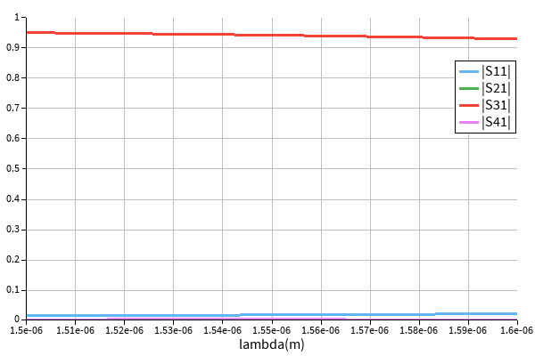
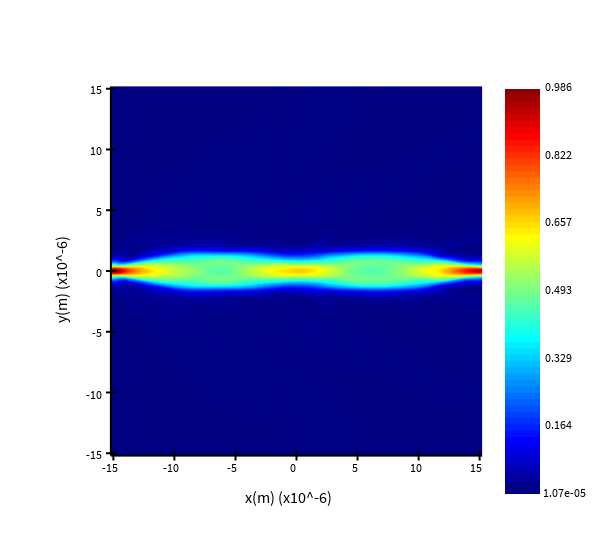

# crossing_SiN_1550

## Description

A crossing operating at a wavelength of 1550nm. Useful for crossing two waveguides with minimal crosstalk. The device was simulated using Lumerical FDTD.

## Simulation

*Fig. 1: Simulated S-parameters of crossing_SiN_1550* 

*Fig. 1: Simulated field distribution of crossing_SiN_1550* 

## Model Name

*Fig. 1: Layout of crossing_SiN_1550* 

## Compact Model Information

- There is no compact model of the device yet

## Parameters

- Fixed component. No parameters to set.

## Experimental Results

- This device has not ben tested yet