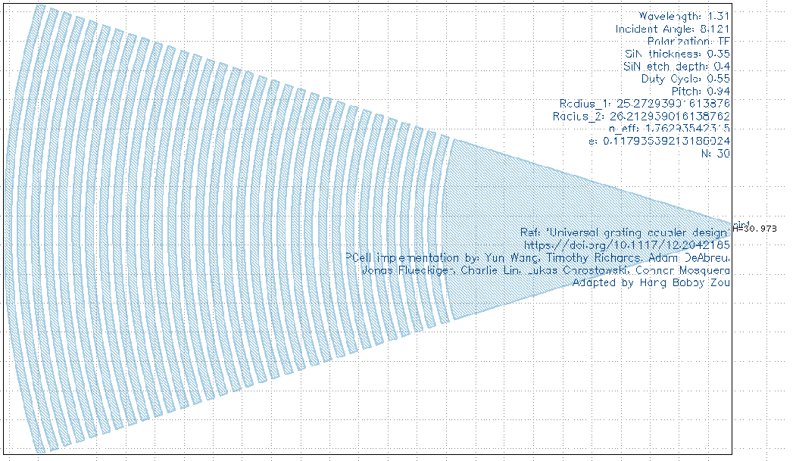
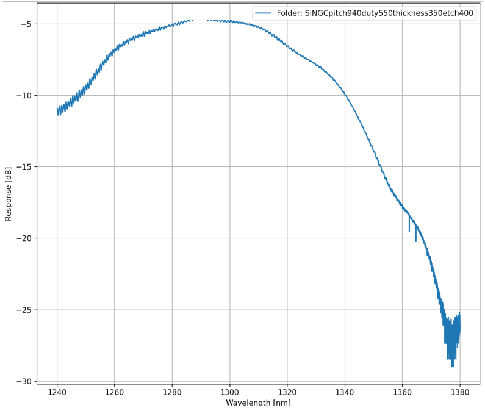

# ebeam_bdc

- ebeam_GC_SiN_TE_1310_8deg

## Description

A grating coupler is used to couple light straight from a fibre to on-chip photonic components
without the need for micro-mechanics etch coupling techniques. The design is a compact
focusing grating coupler used for TE polarization at O-band with 8 degree insertion angle on the
SiN platform offered by ANT.

## Model Name

*Fig. 1: Layout of ebeam_GC_SiN_TE_1310_8deg*

## Compact Model Information

- Support for TE polarization
- Operating at 1310 nm wavelength
- Performance (Insertion Loss, 3dB Bandwidth):
  - TE – ~ 5dB of IL, ~40nm of BW

## Parameters

- Fixed component. No parameters to set.

## Experimental Results

*Fig. 2: Measured grating coupler spectra for TE 1310 nm*

## Additional Details

- **Design tools & methodology:**
  - MATLAB
  - 3D-FDTD (Lumerical FDTD Solutions)
  - Eigenmode expansion propagator (MODE Solutions)

- **Reference:**
    1. Universal grating coupler design, https://doi.org/10.1117/12.2042185 PCell implementation by: Yun Wang, Timothy Richards, Adam DeAbreu, Jonas Flueckiger, Charlie Lin, Lukas Chrostowski, Connor Mosquera
    2. Silicon Photonics Design: From Devices to Systems. L. Chrostowski and M. Hochberg, Cambridge University Press, 5 2015.

