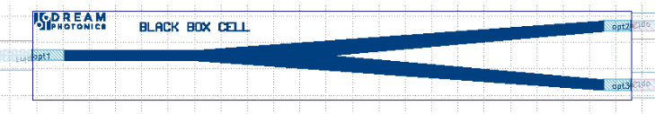
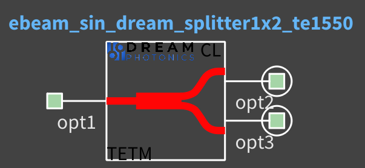

# ebeam_sin_dream_splitter1x2_te1550

## Description

50/50% 3dB splitter. Useful for splitting light, Mach-Zehner Interferometers, etc. The layout parameters for the
device were taken from the journal paper below, and implemented in EBeam lithography.

Component is a Blackbox provided by Dream Photonics Inc. Please contact info@dreamphotonics.com for more information.

## Model Name

*Fig. 1: Layout of ebeam_sin_dream_splitter1x2_te1550* 

## Compact Model Information

*Fig. 2: Compact model of ebeam_sin_dream_splitter1x2_te1550*

- Support for TE polarization
- Operating at 1550 nm wavelength
- Performance:
  - Excess Loss is < 0.1 dB

## Parameters

- Fixed component. No parameters to set.

## Experimental Results

*Fig. 3: Experimental Results for TE 1550 nm*
